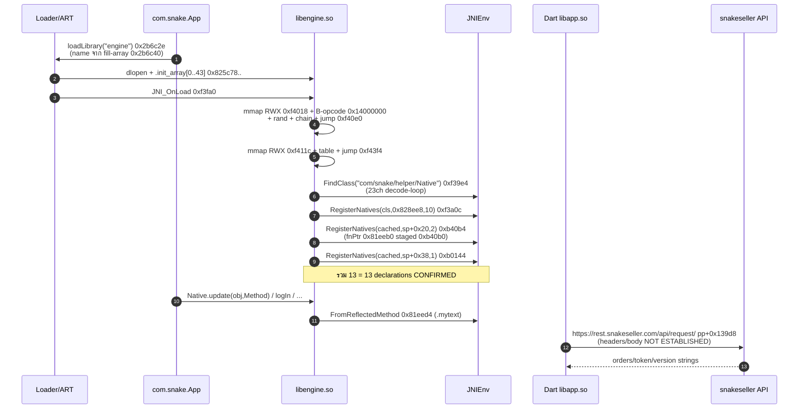
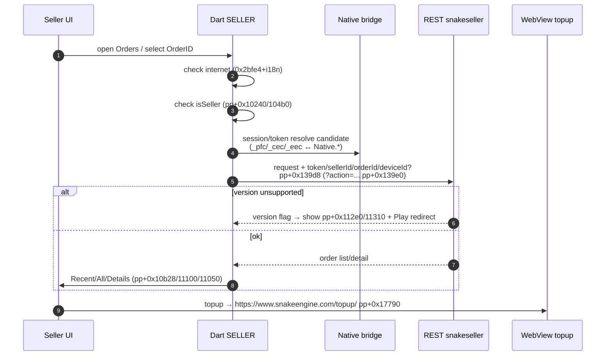

# Snake Engine 2.2.6 (`com.snake`) — รายงานวิเคราะห์ Static: ตรรกะธุรกิจ + การไหลของข้อมูล

> บทบาท: นักวิจัยความปลอดภัยมือถืออาวุโส + Reverse Engineer
> เป้าหมาย: ถอดตรรกะธุรกิจและแมป data-flow ของส่วนประกอบสำคัญ จากไฟล์ที่ดึงจาก APK (DEX / Manifest / Native / Dart AOT) โดยไม่สร้างโค้ดปลอม
> วันที่วิเคราะห์: 2026-09-22 | แหล่งหลักฐาน: `Codes/SnakeLogic/` (APK sha256 `f84760…`, DEX `e2b1fb…`, `libengine.so` `f5d751…`, `libapp.so` `2d3577…`)

**วินัยหลักฐานที่ใช้ทั้งรายงาน (ห้ามตีความข้ามขั้น):**
- `CONFIRMED` = เห็นตรงจากไบต์/offset ที่ commit ไว้
- `INFERRED` = ตีความเชิงความหมายที่มีหลายหลักฐานรองรับ
- `NOT ESTABLISHED` = พิสูจน์ไม่ได้จาก static ชุดนี้ — ระบุชัด ไม่เติมเอง

**ขอบเขต:** เน้นเฉพาะตรรกะ custom ของแอป (`com.snake.*`, `com.Entry`, `libengine.so` custom, `libapp.so` Dart custom) ไม่ลงลึก AndroidX/Support/Retrofit/Firebase internals ยกเว้นในฐานะ transport/entry เท่านั้น

---

## 1. ภาพรวมระดับสูง (High-Level Overview)

แอปเป็น **Flutter Android (Dart AOT + Android Bridge + Native)**:

```text
com.Entry (Launcher Activity) + com.snake.App (Application)
        |
        +---> com.snake.helper.Native / flagger (JNI bridge, 13 natives)
        |               |
        |               +---> libengine.so (arm64, 8.5MB, RegisterNatives ล้วน, RWX bootstrap)
        |
        +---> com.snake.helper.Proxy* P0-P3 / DaemonService / Providers (IPC + Background)
        |
        +---> InternalWebBrowser / WebView (OAuth/Social/Topup Web plane)
        |
        +---> libapp.so (Dart AOT 5.6MB, Dart 3.5.4, snapshot 80a49c71…)
                        |
                        +---> Seller plane: login / Access Token / Seller ID / Orders
                        +---> REST: https://rest.snakeseller.com/api/request/  [pp+0x139d8]
                        +---> Topup Web: https://www.snakeengine.com/topup/   [pp+0x17790]
                        +---> MethodCall handlers: _pfc / _cec / _eec (Ieg.dart)
                        +---> Self-inspection: /proc/self/maps + regex (pp+0xe448/e460)
```

**ข้อสรุปเชิงสถาปัตยกรรม (CONFIRMED):**
1. Native ทั้ง 13 ตัวผูกแบบ dynamic ทั้งหมด (`Java_*` exports = 0, RegisterNatives 3 sites รวม nMethods = 13 พอดี)
2. `libengine.so` ไม่มีชื่อ JNI ใดๆ เป็น plaintext (48 identifiers ค้น 0 hits) — ตาราง `JNINativeMethod` ถูกถอดรหัส/ประกอบตอนรัน
3. `JNI_OnLoad` ไม่ได้ register อะไรเลย — ทำหน้าที่ประกอบโค้ดตอนรัน (mmap RWX + เขียน B opcode + กระโดดเข้าไป)
4. Dart รู้จัก Java ตรงๆ แค่ `com.snake` (1 hit ที่ `0x3bd3a` = `pp+0xe458` = manifest package) + 3 MethodCall closures — ไม่มี channel name เป็น string ใน pool
5. Endpoint custom มีจริง 2 เส้นใน `libapp.so` และเป็น pool-exact ทั้งคู่ — นี่คือ **custom control/data plane** ที่แข็งแรงที่สุด ไม่ใช่ Firebase infra
6. `flagger.na/nb` ถูก register จริงแต่ไม่มี Java caller (0 sites) — เป็นได้แค่ dead / reflective / Dart-triggered
7. Caller ของ `Native` 20 จุดส่วนใหญ่อยู่ใต้ `androidx.appcompat.view.menu.*` — นี่คือ **identifier obfuscation** (โค้ดแอปถูก rename เข้า namespace framework) ไม่ใช่โค้ดเมนูจริง

**สิ่งที่ไม่ควรด่วนสรุป (NOT ESTABLISHED):** beacon/polling interval, command table, header schema (`clientAuth/apiToken/clientVersion/signature` ถูกพิสูจน์แล้วว่า **ไม่ใช่** pool strings — เป็น obfuscated Dart identifiers), ขั้นตอน exfiltration, RCE — ทั้งหมดนี้ต้องใช้ runtime capture

---

## 2. การวิเคราะห์จุดเริ่มต้น (Entry-Point Analysis)

### E1 — App Start → Native Bootstrap [CONFIRMED]

| # | Trigger | บรรทัดสำคัญ | พฤติกรรม |
|---|---|---|---|
| E1.1 | Process start → `Application.<clinit>` | `classes.dex+0x2b6c2e` `System.loadLibrary("engine")` ใน `Lcom/snake/App;-><clinit>` | ชื่อ `engine` ไม่อยู่ใน string pool — ประกอบจาก `fill-array-data` ที่ `0x2b6c40` = `656e67696e65` |
| E1.2 | `dlopen` | `SONAME=libengine.so` | loader แมป `lib/arm64-v8a/libengine.so` (provenance MATCH) |
| E1.3 | Loader → constructors | `.init_array` 44 slots `0x825c78–0x825dd0` | ค่าทุก slot มาจาก `R_AARCH64_RELATIVE` (บนดิสก์เป็น 0) ปลายทางอยู่ `.text` ทั้งหมด; 37 ตัว share prologue เดียวกัน |
| E1.4 | Loader → entry | `libengine.so+0xf3fa0` `JNI_OnLoad` (export เดียวที่เป็น FUNC) | ไม่ register (0 JNIEnv slot loads) — ทำ RWX bootstrap แทน (ดู E2) |
| E1.5 | Flutter parallel | `classes.dex+0x2bafda` `loadLibrary("flutter")` + `libflutter.so#JNI_OnLoad` | `const-string "flutter"` ที่ `0x2bafd6`; engine ผูก 41 natives แบบ dynamic เช่นกัน — ยืนยันว่ากลไกนี้เป็นเรื่องปกติ ไม่ใช่สิ่งผิดปกติเฉพาะแอป |

**การถอดรหัส obfuscation:** `fill-array-data` + `new String([B])` คือ string-concealment ขั้นพื้นฐาน — ซ่อนชื่อไลบรารีจาก `strings`/string-pool grepper แต่กู้ได้ด้วยการถอด payload 6 ไบต์

### E2 — JNI_OnLoad: Runtime Code Builder [CONFIRMED]

บรรทัดสำคัญ (F4c/F7):
- `0xf3fd8: bl sysconf` — อ่าน `_SC_PAGESIZE` (เตรียมขนาด mmap)
- `0xf4018: svc mmap prot=7(RWX) flags=0x22` — หน้า RWX หน้าที่ 1
- `0xf4040: w28=0x14000000` (AArch64 `B` opcode) + `0xf406c: bl rand` — ผสม opcode กับ `rand()` + mask `0x3ffffff`
- `0xf4078: str w8,[x21,x27,lsl#2]` — เขียน opcode ที่สังเคราะห์ลงหน้า RWX
- `0xf40a0: str w10,[x8]` — เขียน branch ชี้จากหน้าก่อน → หน้าปัจจุบัน (chain)
- `0xf40ac: bl FUN_0091ad58` — helper (ชื่อจาก Ghidra callgraph) — INFERRED ว่า cache-flush/barrier
- `0xf40e0: blr x8` — กระโดดเข้าโค้ดที่เพิ่งเขียน (generated page 1)
- `0xf411c: svc mmap RWX` — หน้า RWX หน้าที่ 2 (table)
- `0xf43f4: blr x8` — กระโดดเข้า generated table หน้าที่ 2
- Ghidra corroboration: 10× mmap RWX + 10× B-opcode stores, 0 JNIEnv slot loads, callees = `rand, FUN_0091ad58, __stack_chk_fail, strlen, sysconf`

**ตรรกะ:** `sysconf → mmap#1 → สร้าง B-opcode วนลูป (4-way dispatch ที่ 0xf4054) → chain → flush → jump → mmap#2 → เติม table (0x550–0x5e8) → jump → strlen/validate ต่อ` — นี่คือ packer/protector stub ไม่ใช่ business logic และไม่ใช่ C2 ด้วยตัวมันเอง

### E3 — JNI Registration (3 sites → 13 natives) [CONFIRMED]

| Site | nMethods (หลักฐาน `w3`) | ตาราง | FindClass / decode-loop | ผูกกับคลาส (CONFIRMED/INFERRED) |
|---|---|---|---|---|
| `0xf3a08` (`blr` ที่ `0xf3a0c`, slot `0x6b8`=215) | 10 (`w3,#0xa` ที่ `0xf3a04`) | `0x828ee8` ใน `.bss` (absolute) | `FindClass` ที่ `0xf39e4`; decode-loop 23 รอบที่ `0xf39d0` = ความยาว `com/snake/helper/Native` (23) | `Native` 10/11 — **strong** (findclass-name-length) |
| `0xb40a8` (`blr` ที่ `0xb40b4`) | 2 (`w3,#2` ที่ `0xb40ac`) | `sp+0x20` (stack-built) | loops [2,3] ที่ `0xb4088` = `na/nb` (2 chars) + `()V` (3 chars) | `flagger` 2/2 — **probable** (count-elimination) |
| `0xb0140` (`blr` ที่ `0xb0144`) | 1 (`w3,#1` ที่ `0xb0130`) | `sp+0x38` (stack-built) | loop 8 รอบที่ `0xb00d0` = `pjowqpxe` (8 chars) | `Native` 1/11 — **probable** (count-elimination) |

รวม 13 = 13 declarations พอดี (VERIFICATION PASS) — **นี่คือ choke point ของสะพานทั้งหมด**

fnPtr เดียวกู้ได้จาก static: `0xb40b0: stp x21,x9,[sp,#0x40]` → `fnPtr=0x81eeb0` ใน `.mytext` (`0x81eeac+0xf4`, exec) — แต่ `0x81eeb0` ถอดเป็น `ret` ส่วน body จริงเริ่ม `0x81eeb4` → INFERRED ว่า pointer ถูก patch ตอนรัน หรือเป็น decoy (gap ระดับ high — ห้ามสรุปว่าเป็น handler สุดท้าย)

### E4 — Java Callers → Native (20 invoke sites) [CONFIRMED]

`Lcom/snake/helper/Native;` ถูก invoke จาก 20 offsets (F2/CH-08) — F2 บันทึกแค่ offset + enclosing method **ไม่บันทึกว่าเป็น native ตัวไหน** ดังนั้น edge จบที่ระดับคลาส:

- `0xed930 b8.callActivityOnResume(Activity)` — **lifecycle trigger** (onResume)
- `0x14324e–0x14349c vx.b/c/f(...)` (6 sites) — กลุ่ม `vx` (INFERRED: session/event logger — มี `(String,long,boolean)` shape คล้าย `logIn`)
- `0x1573c4–0x157930 z10.a/b/c(...)` (3 sites) — `a(String)`, `b(String,String)`, `c(Context)` (INFERRED: string/context dispatch)
- `0x1626fc p60.uncaughtException` — **crash trigger**
- `0x17f438 ne0.run()` — **thread/runnable trigger**
- `0x1b06d0 jv0.O2(String,String)` — string-pair dispatch
- `0x1b3598/0x1b35d6 yu0.f(Context,wb)` — context dispatch
- `0x292228 com.Entry.C(id0,kd0$d)` — **UI/entry trigger** (launcher activity เรียก Native ตรง)
- `0x2b911c Native.a(Activity,String,IJZ)` + `0x2b914e Native.logIn(String,J)` — **self/inner trigger** (login/session bridge เรียก native ภายใน)
- `0x38e7ec TextureRegistry.setOnTrimMemoryListener` — memory-pressure trigger (INFERRED: ชื่อนี้ก็น่าสงสัยว่าถูก obfuscate เช่นกัน)

`flagger` = **0 callers** — สมมติฐานที่เหลือ: dead code / reflection (`Class.forName("com.snake.helper.flagger")`) / Dart MethodCall — ต้องใช้ Frida `RegisterNatives` dump + `CallVoidMethod` trace ปิด

### E5 — Dart/Flutter Plane (libapp.so) [CONFIRMED]

- Snapshot `80a49c71…` ที่ `0x214` + `0x40d4` ตรงกับ `libflutter.so@0x1eafd4` + build log (Dart 3.5.4) — blutter dump ผูกกับไบนารีนี้แน่นอน
- 11 `PlatformConfigurationNativeApi::*` ตรงกัน 11/11 — ช่อง `SendPlatformMessage/RespondToPlatformMessage` คือสะพาน Dart↔Android อย่างเป็นทางการ
- 3 MethodCall handlers ใน `Ieg.dart` (ไลบรารี C2): `_pfc(_dX):379`, `_cec(_hX):468`, `_eec(_hX):471` — มี address (`0x504300/0x50e170/0x50dad8`) + pool slots (`pp+0x3910/0x2cd8/0x2ce8`) แต่ **ไม่มี disassembly** (`size:-1`) — หยุด data-flow ระดับ instruction ไว้ตรงนี้
- **Case-sensitivity trap (CONFIRMED):** `encryptedData@0x427c0` อยู่ข้าง `_Pfc@227452173` (ตัว P ใหญ่) ไม่ใช่ `_pfc@286240726` (ตัว p เล็กที่เป็น MethodCall handler) — ห้ามโยง `encryptedData` เข้ากับ handler นี้

### E6 — Android IPC / Background / Push [CONFIRMED จาก Manifest + Report]

- Proxy families `P0–P3` × (Activity/Service/JobService/ContentProvider/PendingActivity/TransparentActivity) — 4-way routing/fabric (INFERRED: plugin/parallel-process framework)
- `ProxyContentProvider.call(String,String,Bundle)` + `SystemCallProvider.call + a():boolean + b(Bundle)` — **command-dispatch bottleneck** (method/arg เป็น runtime strings — ซ่อนคำสั่งได้ไม่จำกัดหลัง entry เดียว)
- `DaemonService.onStartCommand/onTaskRemoved/onDestroy/onBind` — `onTaskRemoved` คือสัญญาณ restart/reschedule (exact policy NOT ESTABLISHED)
- `ProxyVpnService` + `VpnService.SUPPORTS_ALWAYS_ON=true` + foreground-service/wakelock permissions — รองรับงาน long-running
- FCM: `FirebaseMessagingService` + `FirebaseInstanceIdReceiver` + `auto_init=true` — push-delivery channel มีจริง แต่ **payload semantics NOT ESTABLISHED** (ห้ามเรียก FCM ว่า C2)
- `InternalWebBrowser` (WebView + ProgressBar + URL validation) — Web/OAuth plane แยกจาก REST plane
- Permissions 184 รายการ (INTERNET, FOREGROUND_SERVICE, QUERY_ALL_PACKAGES, location/contacts/SMS/call-log ฯลฯ) — กว้างผิดปกติ แต่ permission ≠ การใช้งานจริง ต้องตามด้วย API-call trace

---

## 3. การติดตามตัวแปรและข้อมูล (Source → Processing → Sink)

### 3.1 ตาราง Data-Flow หลัก (เฉพาะที่พิสูจน์ได้)

| # | Data | Source (ต้นทาง) | Processing (การประมวลผล) | Sink (ปลายทาง) | สถานะ |
|---|---|---|---|---|---|
| D1 | ชื่อไลบรารี `engine` | `fill-array-data` payload `0x2b6c40` | `new String([B])` → `loadLibrary` | `dlopen libengine.so` → `.init_array` → `JNI_OnLoad` | CONFIRMED |
| D2 | JNI class/method names | runtime decode-loops (8/2/3/23) + stack/`.bss` tables | byte-decode (`ldrb→blr→strb` วนรอบ) แล้ว `RegisterNatives` | ART method table (13 bindings) | CONFIRMED (counts+lengths); names INFERRED |
| D3 | `java.lang.reflect.Method` | Java caller ของ `Native.update(Object,Method)` | `.mytext@0x81eed4 FromReflectedMethod(x3→jmethodID)` → `bl 0xb01c4` | native handler ต่อ (unresolved `sub_b01c4`) | CONFIRMED (shape-match ตัวเดียวใน 13) |
| D4 | Seller credentials/session | UI login (`Login only for sellers` `pp+0x10240`) + `Native.logIn(String,long[,boolean])` | session bridge (Java↔native) — body NOT ESTABLISHED | `Access Token` (`pp+0x11508`) + `Seller ID` (`pp+0x115f0`) + UI copy/logout | CONFIRMED (strings+method shape); transport NOT ESTABLISHED |
| D5 | Order request | Seller session + `Order ID` input (`pp+0x11080`) | Dart HTTP (`dart:_http` closures; `deviceId` `pp+0x43c0`, `authorization` `pp+0xa640` อยู่ใกล้แต่เป็น framework/http infra) | `POST/GET https://rest.snakeseller.com/api/request/` (`pp+0x139d8`) | CONFIRMED (endpoint); headers/body NOT ESTABLISHED |
| D6 | Order display | REST response | Dart parse → i18n strings (`Recent Orders`/`Order Details`/`All Orders` + 5 ภาษา) | Flutter UI | INFERRED (strings + `AwaitStub/InitAsync` fan-in สูง = async fetch) |
| D7 | Topup flow | Order/seller action | Web navigation ผ่าน `InternalWebBrowser`/WebView (INFERRED) หรือ API (NOT ESTABLISHED) | `https://www.snakeengine.com/topup/` (`pp+0x17790`) | CONFIRMED (URL); channel NOT ESTABLISHED |
| D8 | Platform-channel calls | Dart `_pfc/_cec/_eec(dynamic,MethodCall)` | `SendPlatformMessage/RespondToPlatformMessage` (engine symbols) | Java `Native.*` (candidate — ไม่มี channel-name string ผูก) | INFERRED (shape-only) |
| D9 | IPC commands | `Provider.call(method,arg,Bundle)` / Service intents / FCM | P0–P3 routing + `DaemonService` keep-alive | target Activity/Service/Provider ปลายทาง | CONFIRMED (surface); vocabulary NOT ESTABLISHED |
| D10 | Self-inspection | `/proc/self/maps` (`pp+0xe448`) + regex (`pp+0xe460`) + `com.snake` (`pp+0xe458`) คั่นกลาง | maps-line parsing (closure ไม่ถูก disassemble) | การตัดสินใจใน Dart (anti-tamper candidate) | CONFIRMED (adjacency); semantics INFERRED |
| D11 | Version gate | version-lock strings (`pp+0x112e0/0x11310`: not supported / not OFFCIAL) | ??? ↔ `flagger.na/nb` (0 callers) | บังคับอัปเดต/บล็อก (candidate) | HYPOTHESIS เท่านั้น |
| D12 | Native env signals | `__system_property_get` (`ro.build.version.sdk` ฯลฯ) + `getauxval` + `dl_iterate_phdr` + `prctl` + `process_vm_readv` | capability/environment gating ใน `libengine.so` | global native state / branch decisions | INFERRED (imports + report) |

**สิ่งที่ถูกถอน/ปฏิเสธแล้ว (ห้ามใช้):**
- `helperError@0x4343a` → ไม่ใช่ bridge หา `helper/*` — เป็น Flutter `InputDecorator` enum member (blutter Obj!_WF) — substring false positive
- `clientAuth/apiToken/clientVersion/signature` → ไม่ใช่ HTTP headers — pool hits = 0, `C2_headers.txt` = 0 lines, neighbourhood เป็น Dart identifiers
- `api.flutter.dev/flutter.dev` URLs → framework error/doc text (pool-embedded ใน `pp+0x408/0x130`) ไม่ใช่ app endpoints
- `imgur.com` → support text หลายภาษา (`If you have screen shots please upload to…`) ไม่ใช่ exfil
- store links → regex-escaped patterns (`\?`) ที่ `pp+0x178b0/0x178b8` — เก็บไว้ match ไม่ใช่เปิด

---

## 4. การแยกย่อยตรรกะทางธุรกิจ (Business Logic Breakdown)

### 4.1 C1 — Native Bootstrap Protector (`JNI_OnLoad`)

**เงื่อนไข/ลูป (CONFIRMED จาก decode 420 insns + Ghidra):**

| จุด | เงื่อนไข/ลูป | ผล |
|---|---|---|
| `0xf4024 b.eq 0xf40b0` | `mmap == -1`? | ข้ามการเขียนหน้า → นับหน้าถัดไป (fail-soft ต่อได้) |
| `0xf402c b.lo 0xf4088` | `pagesize < 4`? | ข้าม loop เขียน opcode |
| `0xf4038–0xf4084` | `for (x27=0; x27!=x24; x27++)` + 4-way `br x10` (dispatch table `0x125d4`) | เลือก 1 ใน 4 สูตรสร้าง opcode ต่อ word: `rand() & mask \| 0x14000000` |
| `0xf4088 cbz` / `0xf40b0–0xf40b8` | `for (x22=0; x22!=7; x22++)` | สร้าง 7 หน้า; หน้าที่ n>0 ถูก chain ด้วย branch จากหน้าก่อน (`0xf40a0`) |
| `0xf40ac` | flush helper | INFERRED: `__clear_cache`/barrier ก่อน execute |
| `0xf40e0 / 0xf43f4` | `blr` เข้า generated | หลุดจาก static view — ต้อง dump ตอนรัน |
| `0xf4428/0xf4458 svc 53 (fchmodat)` | เตรียมแค่ `x0` | หมายเลข syscall พิสูจน์แล้ว แต่อาร์กิวเมนต์ไม่ครบ — ห้ามสรุป path/operation |
| `0xf4470 cmp x0,#0xb` / `0xf45c0 cmp x0,#0xa` | `strlen(s)==11?` → 4-way byte-check loop; `strlen==10?` → อีกรอบ | INFERRED: string-gate/validation หลัง bootstrap (fail → `0xf5984`) |

### 4.2 C2 — JNI Registration Sites (3 windows, รูปทรงเดียวกัน)

ทุกรูปแบบ: `mmap-stub → bl sub_77xxxx (คืน decoder object) → bl sub_81f140 (record 12B, w0=#0xc) → decode-loop (ldrb→vtable-blr→strb, cmp N) → [memcmp-shape ที่ 0xb00e4 เฉพาะ site#1] → FindClass (เฉพาะ site#3) → RegisterNatives → fail-path (ExceptionClear ที่ site#1 / return 0-1 ที่ site#3)`

| Site | ตารางตรรกะสำคัญ |
|---|---|
| `0xf3a08` (n=10) | `FindClass==NULL → return 0` (`0xf39ec cbz`); `RegisterNatives<0 (tbnz bit31) → return 0` มิฉะนั้น `return 1` |
| `0xb40a8` (n=2) | ประกอบ `JNINativeMethod[1].fnPtr=0x81eeb0` (`adrp 0x81e000+0xeb0` ที่ `0xb4094–0xb4098` + `stp` ที่ `0xb40b0`) ก่อน `blr RegisterNatives`; `stack_chk_fail` ที่ `0xb40e8` |
| `0xb0140` (n=1) | `bl 0x81f250(ptr,ptr,8)→int; cbnz→ข้าม flag-fix` (`0xb00e4–0xb00e8`) — **รูปทรง memcmp 8 ไบต์** (INFERRED: ตรวจชื่อ 8 ตัว = `pjowqpxe` ก่อน register); `ExceptionClear` (`0xb018c`) บน fail-path; bit-twiddling บน `.bss` flags (`0xb00f0–0xb0118`, `0xb014c–0xb0178`) |

### 4.3 C3 — `Native` 11 + `flagger` 2: ถอดรหัสชื่อ obfuscated

| ชื่อดิบ (signature) | การตีความเชิงพฤติกรรม | หลักฐาน |
|---|---|---|
| `ac(Object,Object)` | opaque 2-object dispatcher (INFERRED: event/context pair) | 2×Object, void |
| `aior(String,String)` | opaque string-pair dispatcher (INFERRED: id/secret หรือ action/param — ห้ามสรุปว่า user/pass) | 2×String, void |
| `awl(String)` | single-string dispatcher | 1×String, void |
| `chl(byte[])→boolean` | **decision gate / validator** (`if (chl(buf)) … else …`) | คืน boolean — จุด branch ธรรมชาติ |
| `djp(int)→byte[]` | indexed buffer provider (INFERRED: config/key/blob ตาม id) | int→byte[] |
| `eio()→void` | no-arg trigger/gate | ()V |
| `i(int)→void` | int-command dispatcher (`switch(cmd)`) | (I)V |
| `ic(Context)→void` | context-aware init | (Context)V — เข้าถึง app/env ได้ |
| `ilil(int)→String` | int→string resolver (INFERRED: deobfuscate/lookup) | (I)Ljava/lang/String |
| `pjowqpxe(O,O,O)→void` | 3-object dispatcher; ถูก register แยกเดี่ยว (n=1, loop=8) | ชื่อยาว 8 = decode bound |
| `update(Object,Method)→void` | **reflection bridge** — แปลง `Method→jmethodID` ผ่าน `FromReflectedMethod` | ตัวเดียวใน 13 ที่รับ `Method`; ตรงกับ `.mytext` ที่ `0x81eed4 (x1=x3)` |
| `flagger.na/nb()→void` | 2 flag-triggers ที่ไม่มี caller; candidate คู่กับ version-lock strings | n=2, loops [2,3], 0 invoke sites — HYPOTHESIS |

Java-side helpers (`a(Activity,String,IJZ)`, `b(…)`, `gcuid(int)→int`, `getApplicationInfo`, `il(File/String)`, `logIn(String,long[,boolean])`) — INFERRED: `logIn*` = session bridge; `il` = normalize/transform; `gcuid` = id-map; `getApplicationInfo` = package lookup — body NOT ESTABLISHED ต้อง decompile `com.snake.helper.*` ต่อ

### 4.4 C4 — Seller Business Plane (Dart)

**State machine ที่สรุปได้จาก pool strings (CONFIRMED strings, flow INFERRED):**

| State | สัญญาณ (pool) | Transition |
|---|---|---|
| `NO_NETWORK` | `You are not connected…` + แปล 5 ภาษา (`0x2bfe4` ฯลฯ) | `if (!online) show banner; return` |
| `LOGIN_GATE` | `Login only for sellers` (`pp+0x10240`); `This device can have access to seller login…` (`pp+0x104b0`) | `if (!isSeller) deny` |
| `AUTHENTICATED` | `Your Access Token` / `Your Seller Id :` / `secure access token…` (`pp+0x11508–0x115f0`) | `login → store token+sellerId → enable orders` |
| `ORDERS` | `Recent Orders` / `All Orders` / `Order Details` / `Order ID` (`pp+0x10b28/0x11100/0x11050/0x11080`) | `fetch recent → list → select → details`; empty → `Anda belum mempunyai pesanan…` (i18n empty-state) |
| `TOPUP` | `https://www.snakeengine.com/topup/` (`pp+0x17790`) | จาก order/seller action → web/topup |
| `VERSION_BLOCK` | `not supported…from * to #` / `not OFFCIAL…install from Google Play` (`pp+0x112e0/0x11310`) | `if (version unsupported) block + redirect to Play` (candidate เชื่อม `flagger`) |
| `LOGOUT` | `Tap to logout from your seller account` (`pp+0x11220`) | clear session |

**Request-shape ที่เห็น:** `?action=upload_profile_image` (`pp+0x139e0`) ติดกับ endpoint `pp+0x139d8` ใน allocation เดียวกัน — INFERRED ว่า API ใช้ `?action=` style อย่างน้อย 1 action; action อื่นๆ NOT ESTABLISHED

### 4.5 C5 — IPC / Background / Push

| คอมโพเนนต์ | ตรรกะ (CONFIRMED surface + INFERRED role) |
|---|---|
| `ProxyContentProvider.call(m,a,Bundle)` / `SystemCallProvider.call + a() + b(Bundle)` | `dispatch(method, arg, extras) → switch(method)` — vocabulary ซ่อนใน runtime strings; `a():boolean` = gate/check; `b(Bundle)` = bulk-command |
| `ProxyService/ProxyJobService P0–P3` | 4-way execution slots (foreground/job) — INFERRED: แยกตาม process/task (`:p0–:p3` ใน manifest) |
| `DaemonService.onTaskRemoved` | `onTaskRemoved → handle state → [restart/reschedule?]` — restart NOT ESTABLISHED |
| `ProxyVpnService` | VPN slot + always-on — มี channel แต่ traffic semantics NOT ESTABLISHED |
| FCM path | `push → FirebaseMessaging callback → [parser → action?]` — parser/action NOT ESTABLISHED |
| `InternalWebBrowser` | `validate(url) → WebView.load → onProgress/onPageFinished` — ปลายทาง: Google OAuth + facebook/t.me/wa.me/discord + topup |

---

## 5. รหัสเทียมพร้อมคำอธิบาย (Readable Pseudocode)

> กฎ: ไม่คัดลอกโค้ดดิบ — สรุปขั้นตอน + อ้าง key offsets; ส่วนที่ไม่มีหลักฐานใส่ `/* NOT ESTABLISHED */` ชัดเจน

### P1 — Startup & Native Bootstrap

```text
// ENTRY: กระบวนการเริ่ม (CONFIRMED: manifest application=com.snake.App)
static_init com.snake.App:
    bytes = dex.fill_array_data(0x2b6c40)          // 6 bytes: 65 6e 67 69 6e 65
    name  = new String(bytes)                      // "engine" — ซ่อนจาก string pool
    System.loadLibrary(name)                       // 0x2b6c2e → dlopen libengine.so
    // loader: .init_array[0..43] ← rela.addends   // 0x825c78.. — 44 targets ใน .text
    JNI_OnLoad()                                   // 0xf3fa0

JNI_OnLoad:                                        // 0 JNIEnv calls — เป็น code-builder
    pageSize = sysconf(_SC_PAGESIZE)               // 0xf3fd8
    pages = []
    repeat 7 times:                                // 0xf40b0 loop
        p = mmap(NULL, pageSize, RWX, PRIVATE|ANON)// 0xf4018 svc 222
        if p == MAP_FAILED: continue
        // สร้าง branch-opcodes แบบสุ่มต่อ word (4-way dispatch ที่ 0xf4054)
        for i in 0..words_per_page:
            variant = dispatch_table[i & 3]        // 0x125d4, 4 offsets
            pages[i] = (0x14000000 | (rand() & mask[variant]))
        if not first: pages[n-1][0] = branch_to(p) // 0xf40a0 chain
        flush(p)                                   // 0xf40ac FUN_0091ad58 (INFERRED cache-flush)
    run(pages[0])                                  // 0xf40e0 blr — หลุดจาก static
    table = mmap(...)                              // 0xf411c — หน้าที่ 2
    fill table[0x550..0x5e8] from .bss seeds       // 0xf41f8.. shifts/or/lsl
    run(table)                                     // 0xf43f4 blr — หลุดจาก static
    /* ต่อด้วย strlen-gates (11/10) + 4-way byte-check loops — INFERRED validators */
```

### P2 — Registration (ตัวอย่าง site 0xf3a08, n=10 → Native)

```text
// เรียกจาก init/protected body (caller จริงอยู่นอก window ที่ decode)
register_Native_block:                             // @0xf3928..0xf3a4c
    decoder = sub_7778a8(...)                      // 0xf3988 — คืน object (unresolved)
    rec     = sub_81f140(12)                       // 0xf3994 — record 12B (unresolved)
    buf     = mmap(0x18, RWX)                      // 0xf3968 ผ่าน w6=0xde stub
    seed(buf, 23 bytes)                            // 0xf396c.. — 16+7 bytes
    for k in 0..22:                                // 0xf39b8 loop, cmp #0x17(23)
        buf[k] = decoder.vtable0(buf[k], rec)      // 0xf39c4 — decode ทีละไบต์ → "com/snake/helper/Native"
    cls = FindClass(buf)                           // 0xf39e8 slot 6
    if cls == NULL: return 0                       // 0xf39ec
    table = (JNINativeMethod*)0x828ee8             // 0xf39fc — .bss, เติมตอนรัน
    rc = RegisterNatives(cls, table, 10)           // 0xf3a08 slot 215
    return (rc < 0) ? 0 : 1                        // 0xf3a10
// site 0xb40a8 (n=2→flagger) และ 0xb0140 (n=1→pjowqpxe) ใช้รูปทรงเดียวกัน
// ต่างกันที่: stack-table + ไม่มี FindClass ใน window (ใช้ cached handle) + memcmp-8B/exception-clear ที่ site#1
```

### P3 — `.mytext` Reflection Bridge (fnPtr เดียวที่กู้ได้)

```text
// fnPtr 0x81eeb0 ← site 0xb40a8 (stp ที่ 0xb40b0); body เริ่ม 0x81eeb4
// จับคู่กับ Native.update(Object, Method) — ตัวเดียวใน 13 ที่รับ Method (shape-match)
mytext_handler(env, thiz_or_cls, obj, reflectedMethod):   // x0=env,x2=obj,x3=method
    jmethod = FromReflectedMethod(reflectedMethod)        // 0x81eed4 slot 7, x1=x3
    rc_obj  = sub_b01c4(env, obj, jmethod)                // 0x81eee4 — unresolved .text
    // bit-set บน object flags (0x81eee8..): or #1; if (ver>=0x1d) or #0x10000000
    return
```

### P4 — Seller REST Flow (Dart — strings CONFIRMED, transport INFERRED)

```text
// TRIGGER: seller เปิด Orders / ดึง Topup (UI event → async closure)
on SellerAction:
    if (!hasInternet()): show("You are not connected…")  // 0x2bfe4+i18n
    if (!session.isSeller): show("Login only for sellers")// pp+0x10240
    token    = session.accessToken                        // "Access Token" pp+0x11508
    sellerId = session.sellerId                            // "Your Seller Id :" pp+0x115f0
    orderId  = ui.selectedOrderId                          // "Order ID" pp+0x11080

    // INFERRED request — headers/body/payload schema = NOT ESTABLISHED (ห้ามสมมติ Bearer)
    resp = httpCall("https://rest.snakeseller.com/api/request/",   // pp+0x139d8
                    params = { token?, sellerId?, orderId?, deviceId? /*pp+0x43c0*/,
                               action? /*เช่น ?action=upload_profile_image pp+0x139e0 */ })
    if (resp.versionUnsupported): show("…not supported…from * to #") // pp+0x112e0
    else: render(RecentOrders / AllOrders / OrderDetails)  // pp+0x10b28/0x11100/0x11050

on TopupAction:
    openWeb("https://www.snakeengine.com/topup/")          // pp+0x17790
    // ผ่าน InternalWebBrowser (WebView) = INFERRED; เป็น API ตรง = NOT ESTABLISHED

// Dart→Java (candidate): _pfc/_cec/_eec(dynamic, MethodCall) — Ieg.dart:379/468/471
//   → SendPlatformMessage/RespondToPlatformMessage → Native.* (channel name ไม่อยู่ใน pool)
```

### P5 — IPC Command Dispatch (Provider/Service)

```text
// TRIGGER: cross-process call / job / push / task-removed
on Provider.call(method, arg, extras:Bundle):      // ProxyContentProvider/SystemCallProvider
    switch (method):                               // vocabulary = runtime strings → NOT ESTABLISHED
        case ...: return handle(arg, extras)
    // SystemCallProvider.a():boolean = gate; .b(Bundle) = bulk-command (INFERRED)

on DaemonService.onTaskRemoved(intent):
    saveState()
    /* restart/reschedule? = NOT ESTABLISHED — ต้องอ่าน bytecode */

on FcmMessage(msg):
    /* callback → parser → action = NOT ESTABLISHED — FCM เป็น channel ไม่ใช่ข้อสรุป C2 */
```

---

## 6. แผนภาพ Mermaid.js (Workflow / Data-Flow)

### 6.1 ภาพรวมสถาปัตยกรรม + Data-Flow (Flowchart)

```mermaid
flowchart TB
    subgraph ANDROID[Android Layer - CONFIRMED]
        APP[com.snake.App<br/>&lt;clinit&gt; 0x2b6c2e]
        ENTRY[com.Entry<br/>Launcher + callbacks]
        NAT[com.snake.helper.Native<br/>11 natives]
        FLG[com.snake.helper.flagger<br/>na/nb - 0 callers]
        PROV[ProxyContentProvider<br/>SystemCallProvider<br/>call method,arg,Bundle]
        SVC[ProxyService P0-P3<br/>ProxyJobService P0-P3<br/>DaemonService<br/>ProxyVpnService]
        WEB[InternalWebBrowser<br/>WebView]
    end
    subgraph NATIVE[libengine.so - CONFIRMED]
        INIT[.init_array 44<br/>0x825c78..]
        ONLOAD[JNI_OnLoad 0xf3fa0<br/>mmap RWX + B-opcode + jump]
        REG10[RegisterNatives 0xf3a08<br/>n=10 FindClass 23ch]
        REG2[RegisterNatives 0xb40a8<br/>n=2 + fnPtr 0x81eeb0]
        REG1[RegisterNatives 0xb0140<br/>n=1 loop 8ch]
        MYT[.mytext 0x81eeb4<br/>FromReflectedMethod]
    end
    subgraph DART[libapp.so Dart AOT 3.5.4 - CONFIRMED]
        CH[_pfc/_cec/_eec<br/>MethodCall handlers<br/>Ieg.dart]
        SELL[Seller plane<br/>Token / SellerID / Orders]
        REST[https://rest.snakeseller.com/api/request/<br/>pp+0x139d8]
        TOPUP[https://www.snakeengine.com/topup/<br/>pp+0x17790]
        MAPS[/proc/self/maps pp+0xe448<br/>+ regex pp+0xe460]
        VER[version-lock pp+0x112e0/11310]
    end
    subgraph NET[Network - CONFIRMED endpoints]
        API[(snakeseller API)]
        TOP[(snakeengine topup)]
        PUSH[(FCM push<br/>channel only)]
        OAUTH[(Google OAuth / Social)]
    end

    APP -->|loadLibrary engine<br/>fill-array 0x2b6c40| INIT
    INIT --> ONLOAD
    ONLOAD --> REG10 & REG2 & REG1
    REG10 --> NAT
    REG1 --> NAT
    REG2 --> FLG
    REG2 --> MYT
    MYT -.->|update Object,Method<br/>shape-match| NAT
    ENTRY -->|0x292228| NAT
    NAT <-->|MethodChannel candidate<br/>no channel-name string| CH
    CH <--> SELL
    SELL --> REST --> API
    SELL --> TOPUP --> TOP
    WEB --> TOP
    WEB --> OAUTH
    PROV <--> SVC
    SVC <--> SELL
    PUSH -.->|payload NOT ESTABLISHED| SVC
    MAPS -.->|self-inspection| SELL
    VER -.->|candidate gate| FLG
```

### 6.2 Sequence: Bootstrap → Registration → First Native Call



### 6.3 Sequence: Seller Order Flow (Dart Business Logic)



---

## 7. ตารางตรรกะรวม (Conditions Summary)

| ID | เงื่อนไข | กิ่ง True | กิ่ง False | หลักฐาน |
|---|---|---|---|---|
| B1 | `mmap==OK?` | เขียน opcode + chain | ข้ามหน้า (`b.eq`) | `0xf4024` |
| B2 | `FindClass!=NULL?` | RegisterNatives ต่อ | `return 0` | `0xf39ec` |
| B3 | `RegisterNatives>=0?` | `return 1` | `return 0` | `0xf3a10` |
| B4 | `memcmp8(buf)==0?` (site#1) | register path | flag-fix path | `0xb00e4–0xb0088` (shape) |
| B5 | `chl(bytes)?` | proceed | reject/alt | signature `→boolean` (branch ธรรมชาติ) |
| B6 | `online?` | ดำเนิน seller flow | banner + return | `0x2bfe4` family |
| B7 | `isSeller?` | เปิด login/session | `Login only for sellers` | `pp+0x10240` |
| B8 | `version supported?` | orders/topup | block + Play redirect | `pp+0x112e0/11310` |
| B9 | `orders empty?` | empty-state i18n | render list/detail | `pp+0x10b10–0x10b28` |
| B10 | `task removed?` | daemon handle (+restart?) | idle | `onTaskRemoved` (restart ?) |
| B11 | `provider method==?` | dispatch case | default/ignore | `call(m,a,Bundle)` (vocab ?) |
| B12 | `maps-line matches regex?` | self-check decision | ignore | `pp+0xe448+e460` (closure ?) |

---

## 8. สิ่งที่ยืนยันไม่ได้ + วิธีปิด (ห้ามเดา — ต้องรันจริง)

| # | ช่องว่าง | วิธีปิดที่เจาะจง (level offset/symbol) |
|---|---|---|
| G1 | ชื่อ/signature/fnPtr ทั้ง 13 (static เห็นแค่ counts+lengths+1 fnPtr) | Frida hook `JNIEnv.RegisterNatives` (slot 215) พิมพ์ `class/name/sig/fnPtr/module+off` — สคริปต์ `frida_dump_register_natives.js` ที่อ้างใน LINKAGE |
| G2 | ปลายทาง `.mytext→sub_b01c4` + `sub_b134c` + 5 PLT (`0x81f140/0x81f250/0x7775d8/0x777fb0/0x7778a8`) | `readelf --rela.plt` + Ghidra/IDA ตั้งชื่อฟังก์ชันที่ target; hook `blr` dump vtable word |
| G3 | เนื้อหน้า RWX + `computes_branch 0x125d4` (4 offsets) | breakpoint ที่ `str 0xf4078/0xf40a0` + `blr 0xf40e0/0xf43f4` แล้ว dump page + อ่าน int32×4 ที่ `0x125d4` |
| G4 | REST headers/body/auth-schema + `?action=` vocabulary | lab-device HTTP capture (mitmproxy) + `logcat` ตอน login/orders/topup |
| G5 | 3 Dart handlers (`0x504300/0x50e170/0x50dad8`, `size:-1`) | IDA disassemble 3 offsets ใน `.text 0x160000+4178912` หรือ xref จาก `pp+0x3910/0x2cd8/0x2ce8` |
| G6 | `flagger.na/nb` callers + ความสัมพันธ์ version-lock | `CallVoidMethod`/`FromReflectedMethod` trace + กด version-block path ดูว่าชน `na/nb` หรือไม่ |
| G7 | Provider `call()` vocabulary + Daemon restart + FCM parser | hook `Provider.call` log `(method,arg,Bundle)` + `onTaskRemoved` trace + FCM callback trace |
| G8 | `com.snake.helper.*` method bodies (รวม `logIn/il/gcuid/a/b`) | JADX/Ghidra decompile `classes.dex` ตรงๆ (20 invoke sites เป็นจุดเริ่ม) |
| G9 | Contamination | อย่า attribute `com.miniclip.eightballpool` ใต้ `com.snake.zip` ให้ `com.snake` (provenance ปน) |

---

## ภาคผนวก A — ดัชนีบรรทัดสำคัญ (Key Offsets)

```text
DEX : 0x2b6c2e loadLibrary(engine) | 0x2b6c40 "engine" | 0x2bafda loadLibrary(flutter)
      0xed930,0x14324e..0x14349c,0x1573c4..0x157930,0x1626fc,0x17f438,0x1b06d0,
      0x1b3598,0x1b35d6,0x292228,0x2b911c,0x2b914e,0x38e7ec (20 Native callers)
NATIVE: 0xf3fa0 JNI_OnLoad | 0xf4018/0xf411c mmap RWX | 0xf4040/0xf4090 B-opcode
      0xf4054 dispatch | 0xf406c rand | 0xf4078/0xf40a0 writes | 0xf40e0/0xf43f4 jumps
      0xf39e4 FindClass | 0xf3a08 n=10 | 0xb40a8 n=2 | 0xb0140 n=1
      0x81eeac .mytext | 0x81eeb0 fnPtr | 0x81eed4 FromReflectedMethod | 0xb01c4 unresolved
DART: pp+0x139d8 REST | pp+0x17790 topup | pp+0x11508/11530/115f0 token/seller
      pp+0x10b28/11100/11050/11080 orders | pp+0x10240/104b0 login gate
      pp+0xe448 maps + pp+0xe460 regex | pp+0x112e0/11310 version-lock
      Ieg.dart _pfc:379 _cec:468 _eec:471 | 0x504300/0x50e170/0x50dad8
MANIFEST: package com.snake 2.2.6 | app com.snake.App | main com.Entry
      Proxy*P0-P3, DaemonService, ProxyVpnService, Providers, FCM, 184 perms
```

## ภาคผนวก B — การประเมิน C2 (ใช้คำอย่างระมัดระวัง)

- **เรียกได้ (high):** custom remote control/data endpoints 2 เส้น (`rest.snakeseller.com/api/request/`, `snakeengine.com/topup/`) — custom domain + custom path + seller/order/token semantics ล้อมรอบ
- **เรียกได้แบบมีเงื่อนไข (medium):** async control surfaces — `Provider.call`, P0–P3 services, `DaemonService`, FCM — มี channel จริง แต่ command vocabulary/payload ยังไม่กู้ได้
- **ห้ามเรียกจากชุดนี้:** periodic beacon, C2 IP hard-coded, encrypted C2 protocol, polling interval, shell/RCE, exfil protocol, DNS covert — ไม่มีหลักฐาน static รองรับ

*จบรายงาน — ทุกข้อสรุปผูกกับ offset/string ที่อ้างได้ข้างต้น; สิ่งใดไม่มีบรรทัดรองรับถูกทำเครื่องหมาย NOT ESTABLISHED/HYPOTHESIS ไว้ชัดเจน*
